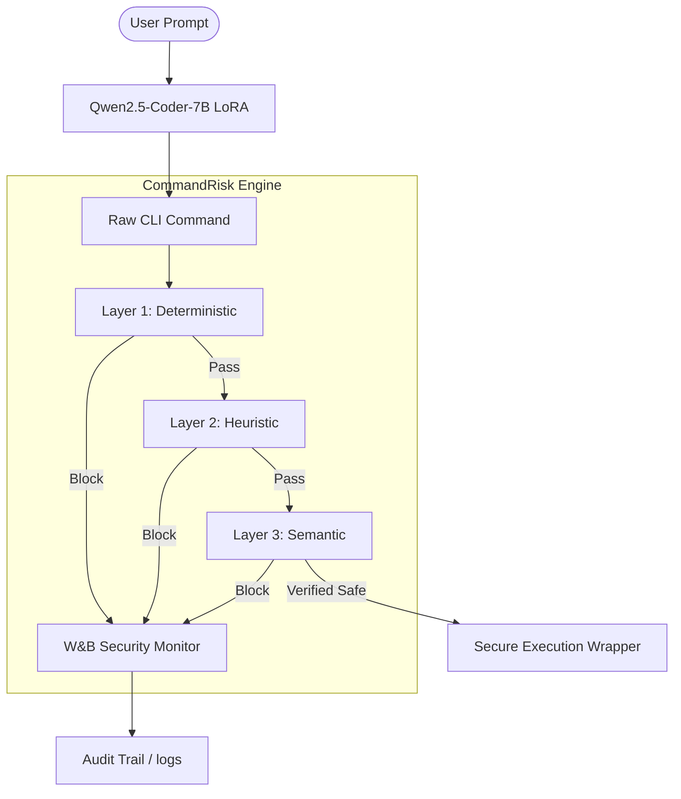

# System Architecture: SecureCLI-Tuner V2

## Executive Overview

SecureCLI-Tuner V2 implements a **Zero-Trust Security Kernel** for Natural Language to CLI generation. The architecture is designed to prevent "Prompt Injection to Execution" attacks by wrapping the LLM output in a multi-stage validation engine called **CommandRisk**.

## Core Architecture Diagram

## Component Breakdown

### 1. Fine-Tuned Generator (`cli_tuner/`)

- **Base:** Qwen2.5-Coder-7B-Instruct.
- **Role:** Translates natural language intent into grammatically correct Bash/Git/Docker commands.
- **Optimization:** Fine-tuned via QLoRA to prioritize safety-aligned system prompts and strictly follow the CLI schema.

### 2. CommandRisk Engine (`commandrisk/`)

The engine operates on the principle of **Defense-in-Depth**:

- **Layer 1: Deterministic (Regex)**
  - Blocks 17+ high-risk patterns (e.g., `rm -rf /`, `chmod 777`).
  - Maps direct violations to **OWASP ASI03 (Abuse of Privileges)**.
- **Layer 2: Heuristic (Anomaly Scoring)**
  - Analyzes command complexity and side-effects.
- **Layer 3: Semantic (CodeBERT/Intent)**
  - Uses CodeBERT embeddings to verify if the generated command actually matches the user's requested intent.
  - Prevents **ASI01 (Agent Goal Hijacking)**.

### 3. Compliance Module (`compliance/`)

- Generates machine-readable **AI-BOMs (CycloneDX)**.
- Maps all security blocks to the **OWASP ASI Top 10** framework for enterprise audit readiness.

## Security Controls (LLMSVS Mapping)

| Control ID | LLMSVS Requirement | SecureCLI Implementation |
| :------- | :------- | :------- |
| **V1.1** | Architecture Trust | No command is executed without passing all 3 layers. |
| **V2.1** | Operating Env | Commands are pre-validated before reaching the host shell. |
| **V5.1** | Monitoring | All blocked commands are synced to WandB with the `security_alert` tag. |

## Data Flow

1. **Request:** User asks to "Delete my temporary log files."
2. **Generation:** Model generates `rm -rf /tmp/logs/*.log`.
3. **Layer 1:** Scans for root deletions (None).
4. **Layer 3:** Compares intent ("Delete logs") vs command ("rm ... .log"). Match = 1.0.
5. **Output:** Verified command is returned to the user with a `security_verified` checksum.
