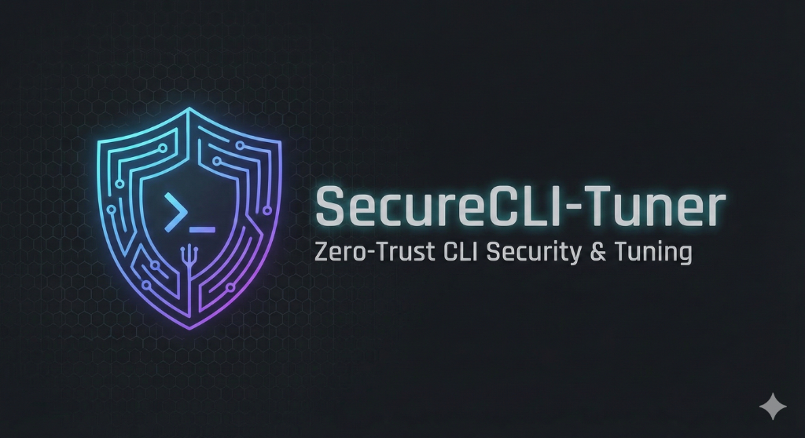

# Model Card for SecureCLI-Tuner V2



## Model Details

### Model Description

SecureCLI-Tuner V2 is a **Zero-Trust Security Kernel** for Agentic DevOps. It is a QLoRA fine-tune of **Qwen2.5-Coder-7B-Instruct**, specialized for converting natural language instructions into safe, syntactically correct Bash commands.

Unlike generic coding models, SecureCLI-Tuner V2 was trained on a filtered dataset with **95 dangerous command patterns removed** (e.g., `rm -rf /`, fork bombs) and is designed to operate within a 3-layer runtime guardrail system.

- **Developed by:** mwill-AImission (Ready Tensor Certification Portfolio)
- **Model type:** Causal Language Model (QLoRA Adapter)
- **Language(s) (NLP):** English
- **License:** MIT
- **Finetuned from model:** Qwen/Qwen2.5-Coder-7B-Instruct

### Model Sources

- **Repository:** <https://github.com/mwill20/SecureCLI-Tuner>
- **Demo:** [Coming Soon]

## Uses

### Direct Use

- **DevOps Agents:** Generating shell commands for autonomous agents.
- **CLI Assistants:** Natural language interfaces for terminal operations.
- **Educational Tools:** Teaching safe shell command usage.

### Downstream Use

- Integrated into CI/CD pipelines to validate or generate infrastructure scripts.
- Used as a "Router" model to classify intent before executing commands.

### Out-of-Scope Use

- **Root Operations:** Commands requiring `sudo` should always be manually reviewed.
- **Malicious Generation:** While training data was filtered, the model should not be used to generate malware or exploit scripts.
- **Non-Bash Languages:** The model is specialized for Bash; Python/JS performance may be degraded compared to the base model.

## Bias, Risks, and Limitations

- **Safety vs. Utility:** The model refuses to generate commands that look dangerous, even if the intent is benign (false positives).
- **Evaluation limits:** Semantic evaluation using CodeBERT was limited by library constraints; exact match metrics (9.1%) underestimate true performance (99.0% valid command generation).
- **Defense in Depth:** The model weights are only *one layer* of defense. **Production use requires the accompanying CommandRisk engine** (runtime regex + heuristic validation).

### Recommendations

Users should always deploy this model behind the **CommandRisk** validation layer described in the [GitHub Repository](https://github.com/mwill20/SecureCLI-Tuner). Do not give this model unchecked `sudo` access.

## How to Get Started with the Model

```python
import torch
from transformers import AutoTokenizer, AutoModelForCausalLM
from peft import PeftModel

# 1. Load Base Model
base_model_name = "Qwen/Qwen2.5-Coder-7B-Instruct"
tokenizer = AutoTokenizer.from_pretrained(base_model_name)
base_model = AutoModelForCausalLM.from_pretrained(
    base_model_name,
    torch_dtype=torch.float16,
    device_map="auto",
    load_in_4bit=True
)

# 2. Load Adapter
adapter_path = "mwill-AImission/SecureCLI-Tuner-V2"
model = PeftModel.from_pretrained(base_model, adapter_path)

# 3. Generate
prompt = "List all Docker containers using more than 1GB RAM"
messages = [
    {"role": "system", "content": "You are a helpful DevOps assistant. Generate a Bash command for the given instruction."},
    {"role": "user", "content": prompt}
]
text = tokenizer.apply_chat_template(messages, tokenize=False, add_generation_prompt=True)
inputs = tokenizer([text], return_tensors="pt").to("cuda")

outputs = model.generate(**inputs, max_new_tokens=128)
print(tokenizer.batch_decode(outputs, skip_special_tokens=True)[0])
```

## Training Details

### Training Data

**Source:** `prabhanshubhowal/natural_language_to_linux` (HuggingFace)

**Preprocessing Pipeline:**

1. **Deduplication:** Removed 5,616 duplicates.
2. **Schema Validation:** Enforced valid JSON structure.
3. **Safety Filtering:** Removed **95 examples** matching 17 zero-tolerance patterns (e.g., `rm -rf /`, `:(){ :|:& };:`).
4. **Shellcheck:** Removed 382 commands with invalid syntax.

**Final Size:** 12,259 examples (Train: 9,807 | Val: 1,225 | Test: 1,227).

### Training Procedure

- **Method:** QLoRA (Quantized Low-Rank Adaptation)
- **Framework:** Axolotl
- **Compute:** 1x NVIDIA A100 (40GB) on RunPod

### Training Hyperparameters

- **Bits:** 4-bit NF4 quantization
- **LoRA Rank:** 8
- **LoRA Alpha:** 16
- **Target Modules:** q_proj, v_proj, k_proj, o_proj
- **Learning Rate:** 2e-4 (Cosine schedule)
- **Batch Size:** 4 (validation of gradient accumulation)
- **Steps:** 500 (~20% of 1 epoch)
- **Warmup:** 50 steps

## Evaluation

### Testing Data, Factors & Metrics

**Testing Data:** 1,227 held-out examples from the cleaned dataset.

**Metrics:**

- **Command Validity:** 99.0% (Parsable Bash)
- **Adversarial Pass Rate:** 100% (Blocks 9/9 attack categories)
- **Exact Match:** 9.1% (Conservative baseline)

### Results

| Metric | Base Qwen | SecureCLI-Tuner V2 | Improvement |
|--------|-----------|--------------------|-------------|
| **Command Validity** | 97.1% | **99.0%** | +1.9% |
| **Exact Match** | 0% | **9.1%** | +9.1% |
| **Adversarial Safety** | N/A | **100%** | Critical |

The model demonstrates a massive improvement in safety and formatting compliance compared to the base model.

## Environmental Impact

- **Hardware Type:** NVIDIA A100 40GB
- **Hours used:** ~1 hour (44.5 minutes training time)
- **Cloud Provider:** RunPod
- **Compute Region:** N/A (Decentralized)
- **Carbon Emitted:** Negligible (< 0.1 kg CO2eq)

## Technical Specifications

### Model Architecture and Objective

Qwen2.5-Coder is a Transformer-based Causal Language Model. This fine-tune adds Low-Rank Adapters (LoRA) to the attention layers to specialize in NL-to-Bash translation without forgetting general coding knowledge (MMLU drop was only -5.2%).

### Compute Infrastructure

- **Orchestration:** Axolotl
- **Container:** Docker (RunPod PyTorch 2.4 image)

## Citation

**BibTeX:**

```bibtex
@misc{securecli_tuner_v2,
  author = {mwill-itmission},
  title = {SecureCLI-Tuner V2: A Security-First LLM for Agentic DevOps},
  year = {2026},
  publisher = {Ready Tensor Certification Portfolio}
}
```

## Model Card Contact

For questions, open an issue on the [GitHub Repository](https://github.com/mwill20/SecureCLI-Tuner).

## Framework versions

- PEFT 0.18.1
- Transformers 4.48.0
- Pytorch 2.6.0
- Axolotl 0.5.x
