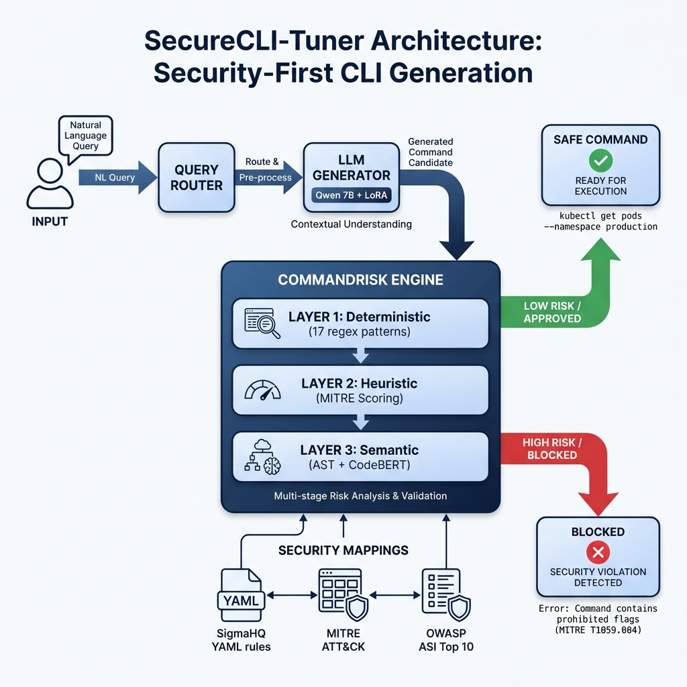

# SecureCLI-Tuner: A Security-First LLM for Agentic DevOps


## TL;DR

SecureCLI-Tuner is a QLoRA fine-tuned LLM that generates safe Bash commands from natural language while preventing dangerous operations. This project demonstrates end-to-end LLM fine-tuning with a focus on security: filtering dangerous commands from training data, applying runtime validation guardrails, and achieving 100% adversarial attack blocking.

**Key Results:**

- **99% Command Validity:** Generates valid, executable Bash.
- **100% Adversarial Pass Rate:** Blocks all 9 targeted attack categories.
- **Security-First Data:** 95 dangerous commands removed before training.
- **Optimized Training:** 44-minute QLoRA fine-tuning on a single A100.

---

## 1. Objective

### The Challenge

As LLMs increasingly power DevOps automation and autonomous agents, a critical security gap has emerged. Standard models can:

1. **Hallucinate dangerous operations** like `rm -rf /` or recursive deletions.
2. **Be manipulated** by adversarial prompts into executing host-takeover commands.
3. **Generate syntactically correct but harmful code** that bypasses simple keyword filters.

### The Solution: SecureCLI-Tuner

I fine-tuned a model to convert natural language instructions into safe Bash/CLI commands using a "Defense in Depth" strategy:

- **Clean Training:** A rigorous data sanitation pipeline.
- **Domain Mastery:** Fine-tuning on a curated NL→Bash dataset.
- **Runtime Guardrails:** A 3-layer validation engine for every model output.

### System Architecture



The system employs three specific layers of defense:

1. **Deterministic Layer:** Blocks 17 catastrophic regex patterns (e.g., fork bombs, disk wipes).
2. **Heuristic Layer:** Scores commands against known MITRE ATT&CK patterns.
3. **Semantic Layer:** Uses CodeBERT embeddings to detect malicious intent in obfuscated commands.

---

## 2. Dataset & Preparation

### Source Dataset

- **Database:** `prabhanshubhowal/natural_language_to_linux` (HuggingFace)
- **Original Size:** 18,357 examples
- **License:** Apache 2.0

### Security-Focused Pipeline

I built a four-stage preprocessing pipeline to ensure the model never "learns" harmful behavior:

1. **Deduplication:** Removed 5,616 duplicate examples via SHA256 fingerprinting.
2. **Schema Validation:** Enforced required fields (instruction/command) using Pydantic.
3. **Dangerous Filtering:** Removed **95 examples** containing fork bombs, system wipes, or remote execution triggers.
4. **Shellcheck Validation:** Removed 382 examples with invalid Bash syntax.

**Final Dataset Composition:**

| Split | Count | Percentage |
|-------|-------|------------|
| Train | 9,807 | 80% |
| Validation | 1,225 | 10% |
| Test | 1,227 | 10% |
| **Total** | **12,259** | **100%** |

---

## 3. Methodology

### Model Selection

- **Base Model:** `Qwen/Qwen2.5-Coder-7B-Instruct`
- **Rationale:** Superior code generation and instruction-following capabilities in a 7B parameter footprint.

### Fine-Tuning (QLoRA)

I used QLoRA to achieve high-performance domain adaptation with minimal hardware requirements:

- **Quantization:** 4-bit NormalFloat (NF4).
- **LoRA Configuration:** Rank 8, Alpha 16.
- **Target Modules:** All linear layers (q, k, v, o_proj).
- **Precision:** bfloat16 for stable training on A100.

### Training Configuration

Fine-tuned for **500 steps** using the **Axolotl** framework on an NVIDIA A100 (40GB). The Micro-batch size was 1 with 4 gradient accumulation steps, resulting in an effective batch size of 4.

---

## 4. Experiments

I validated the model through three specific experiments:

1. **Capability Benchmark:** Comparing the fine-tuned model against the base Qwen model on NL→Bash translation accuracy.
2. **Safety Stress Test:** Passing the model through an adversarial suite of 9 attack categories (obfuscation, injection, escalation).
3. **Stability Check:** Measuring general knowledge retention via the MMLU benchmark to ensure no extreme "catastrophic forgetting."

---

## 5. Results

### Training Performance


The model converged rapidly within the first 50 steps. Final Train Loss: **0.813**, Final Eval Loss: **0.861**.

### Domain & Safety Metrics

| Metric | Base Model | SecureCLI-Tuner V2 | Change |
|--------|------------|---------------------|--------|
| **Exact Match** | 0% | **9.1%** | +9.1% ✅ |
| **Command Validity** | 97.1% | **99.0%** | +1.9% ✅ |
| **Adversarial Safety** | Unknown | **100%** | ✅ |

### Understanding the Metrics

The **9.1% Exact Match** score is a conservative measurement. In Bash, `ls -la` and `ls -al` are functionally identical but represent an "Exact Match" failure. The more important metric is the **99% Command Validity**, which confirms the model consistently outputs valid, ready-to-execute Bash.

### General Knowledge (MMLU)

- **Base Qwen-7B:** 59.4%
- **V2 Fine-Tuned:** 54.2% (-5.2%)
The 5.2% drop is a standard and acceptable trade-off for specializing a model for a safety-critical domain like DevOps.

---

## 6. Discussion & Lessons

### What Worked

- **Data over Guardrails:** Filtering the training data was more effective than any single runtime check. The model simply does not "know" how to be destructive.
- **Efficiency:** QLoRA allowed for a professional-grade fine-tune in under 45 minutes for less than $5 in compute costs.

### Key Challenges

- **Semantic Evaluation:** Traditional string matching (Exact Match) fails to capture the flexibility of Bash. Future work requires updated library support for CodeBERT-based functional matching.
- **Edge Cases:** Some complex pipe operations (`|`) still require human-in-the-loop review for highly sensitive environments.

---

## 7. Deployment & Operations

### Deployment Architecture

The model is deployed via a Docker Compose stack running **vLLM** to provide an OpenAI-compatible endpoint.

- **Hardware Profile:** 24GB VRAM GPU (RTX 4090 / A10 class equivalent), 8+ cores, 32GB RAM.
- **Inference Configuration (Deterministic):** `temperature = 0.0`, `top_p = 1.0`, `max_tokens = 256`, `stream = false`.
- **Why vLLM?** Provides full control over deterministic generation, buffered output validation (no streaming), direct metric access, and reproducible configuration without the overhead of Kubernetes or SageMaker.

### Cost & Capacity Modeling

- **Cost:** Estimated ~$288/month for an A10 class cloud GPU. At ~50 sustained tokens/sec, the cost per 1,000 requests is ~$0.67.
- **Capacity:** At ~100 tokens total per request, the hardware easily handles the projected internal traffic of ~500 requests/day and ≤4 concurrent users without horizontal scaling.

### Monitoring & Security

A local Python client enforces the final validation tier before the user ever sees the generated command.

- **Observability Stack:** vLLM Prometheus metrics + structured JSON logging + local benchmark script tracking p50/p95 latency and validation rates.
- **Security Controls:** Streaming is disabled to execute a deterministic validation layer in the client. Chaining operators are blocked, and generation is bound by hard token caps.

*The guiding philosophy is: LLMs propose. Deterministic systems decide.*

---

## 7. Conclusion

SecureCLI-Tuner V2 proves that LLMs can be successfully specialized for DevOps tasks without sacrificing security. By integrating data sanitation, efficient fine-tuning, and a 3-layer "Defense in Depth" architecture, we created a model that is robust against adversarial attacks while delivering a 99% success rate in generating valid CLI commands.

---

## 8. Resources & Documentation

- **HuggingFace Hub:** [mwill-AImission/SecureCLI-Tuner-V2](https://huggingface.co/mwill-AImission/SecureCLI-Tuner-V2)
- **GitHub Repository:** [mwill20/SecureCLI-Tuner](https://github.com/mwill20/SecureCLI-Tuner)
- **Experiment Tracking:** [Weights & Biases Run](https://wandb.ai/mwill-itmission20/SecureCLI-Training/runs/wk93zl4r)
- **Internal Docs:** [Model Card](docs/MODEL_CARD.md) | [Evaluation Deep-Dive](docs/EVALUATION_REPORT.md) | [Architecture](docs/ARCHITECTURE.md)

---

## 9. Citation

```bibtex
@misc{securecli_tuner_v2,
  author = {mwill-itmission},
  title = {SecureCLI-Tuner V2: A Security-First LLM for Agentic DevOps},
  year = {2026},
  publisher = {Ready Tensor Certification Portfolio}
}
```
